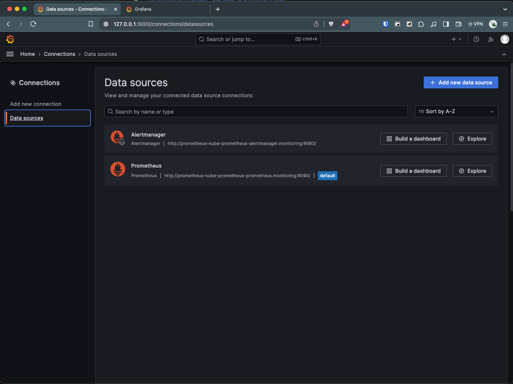

# Uda Metrics Dashboard Base Practices

## Overview
Welcome to the monitoring and visualization project utilizing Prometheus, Jaeger, and Grafana for observing a sample application deployed on a Kubernetes cluster. This repository hosts the necessary resources to set up comprehensive dashboards for monitoring and tracing, ensuring visibility into the application's performance and behavior.

### Base Architecture

# Tasks Executed

## Verify the monitoring installation
Running `kubectl` command to show the running pods and services for all components. Take a screenshot of the output and include it here to verify the installation

### Monitoring Namespace

### Observability Namespace

### Default Namespace

## Setup the Jaeger and Prometheus source
Expose Grafana to the internet and then setup Prometheus as a data source. Provide a screenshot of the home page after logging into Grafana.

## Create a Basic Dashboard
Create a dashboard in Grafana that shows Prometheus as a source. Take a screenshot and include it here.

## Describe SLO/SLI
Describe, in your own words, what the SLIs are, based on an SLO of *monthly uptime* and *request response time*.
- SLIs are the metrics used to measure the performance of a service.
- In the context of the SLO presented above:
  - *monthly uptime*: SLIs could be the number of successful requests over the total number of requests over a month.
  - *request response time*: SLIs could be the average time taken to respond to a request.

## Creating SLI metrics.
*TODO:* It is important to know why we want to measure certain metrics for our customer. Describe in detail 5 metrics to measure these SLIs. 
5 metrics to measure the SLIs:
1. **Uptime**: The percentage of time the service is available over a period.
2. **Latency**: The time taken to respond to a request.
3. **Error Rate**: The percentage of failed requests over the total number of requests.
4. **Throughput**: The number of requests the service can handle per second.
5. **Utilization**: The percentage of resources used by the service.

## Create a Dashboard to measure our SLIs
*TODO:* Create a dashboard to measure the uptime of the frontend and backend services We will also want to measure to measure 40x and 50x errors. Create a dashboard that show these values over a 24 hour period and take a screenshot.

## Tracing our Flask App
*TODO:*  We will create a Jaeger span to measure the processes on the backend. Once you fill in the span, provide a screenshot of it here. Also provide a (screenshot) sample Python file containing a trace and span code used to perform Jaeger traces on the backend service.
MARCO TODO: Check if we need to have image of our own app in Docker for this task. Will probably need to change at least the backend app python file to include the trace and span code.

## Jaeger in Dashboards
*TODO:* Now that the trace is running, let's add the metric to our current Grafana dashboard. Once this is completed, provide a screenshot of it here.

## Report Error
*TODO:* Using the template below, write a trouble ticket for the developers, to explain the errors that you are seeing (400, 500, latency) and to let them know the file that is causing the issue also include a screenshot of the tracer span to demonstrate how we can user a tracer to locate errors easily.

TROUBLE TICKET

Name:

Date:

Subject:

Affected Area:

Severity:

Description:

## Creating SLIs and SLOs
*TODO:* We want to create an SLO guaranteeing that our application has a 99.95% uptime per month. Name four SLIs that you would use to measure the success of this SLO.

## Building KPIs for our plan
*TODO*: Now that we have our SLIs and SLOs, create a list of 2-3 KPIs to accurately measure these metrics as well as a description of why those KPIs were chosen. We will make a dashboard for this, but first write them down here.

## Final Dashboard
*TODO*: Create a Dashboard containing graphs that capture all the metrics of your KPIs and adequately representing your SLIs and SLOs. Include a screenshot of the dashboard here, and write a text description of what graphs are represented in the dashboard.  

